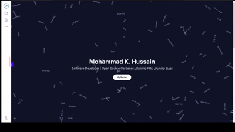

# Portfolio with Volto Hydra



<i>My portfolio using Nextjs as frontend, Plone as headless CMS and Volto Hydra as decoupled editor.</i><br>
The current integration level is Level 1, with plans to advance to Level 3 in the future.

## What is Volot Hydra?

Hydra aka volto-hydra is a proof-of-concept addon for Volto that decouples the frontend from the Plone backend, allowing for a more flexible editing experience. It achieves this by embedding the frontend within an iframe and establishing a two-way communication channel between the iframe and the admin UI using hydra.js. 

Know more about [how Hydra works](https://github.com/collective/volto-hydra?tab=readme-ov-file#how-hydra-works).

### Setting up Hydra

### Installation

**1. Clone the repository**

```bash
git clone https://github.com/MAX-786/hydra-portfolio
cd hydra-portfolio
```

**2. Start Volto-Hydra**

- Run the following command to start the Volto-Hydra site:
    ```bash
    make start
    ```
- You can also set your preset frontend URLs with environment variables, making them available in the admin UI. This allows you to switch between them seamlessly:
    ```bash
    RAZZLE_DEFAULT_IFRAME_URL=http://localhost:3002,https://hydra-blogsite-nextjs.vercel.app pnpm start
    ```
    You can find `.env.example` at root directory of the project.
- Ensure Volto is running on port 3000.

**1. Start the Plone Backend**

- You can start the Plone backend using Docker images:
    ```bash
    make backend-docker-start
    ```
  ***Note :*** This will also set [`CORS_ALLOW_ORIGIN` to `'*'`](https://6.docs.plone.org/install/containers/images/backend.html?highlight=cors#cors-variables), so there are no cors error.


## Getting Started with frontend

### Prerequisites

- Node.js (v14 or later)
- npm, yarn, or pnpm

1. Go to `portfolio` directory:
```bash
cd portfolio
```

2. Install dependencies:

```bash
# npm
npm install

# yarn
yarn install

# pnpm
pnpm install
```

### Running the Development Server

Start the development server:

```bash
# npm
npm run dev

# yarn
yarn dev

# pnpm
pnpm dev
```

Open [http://localhost:3000](http://localhost:3000) with your browser to see the result.

### Building for Production

Build the application for production:

```bash
# npm
npm run build

# yarn
yarn build

# pnpm
pnpm build
```

Locally preview the production build:

```bash
# npm
npm run preview

# yarn
yarn preview

# pnpm
pnpm preview
```

### Asynchronously Loading the Hydra Bridge (for level 2 and further)

To load the Hydra bridge asynchronously, add the following function and call it at any point where you want to load the bridge. Since your application will be loaded inside an iframe in Volto Hydra, the iframe will be passed a `_edit={true/false}` parameter that we can check for. If this parameter is present and set to true, we should be inside the editor and in edit mode.

```js
function loadBridge(callback) {
    const existingScript = document.getElementById("hydraBridge");
    if (!existingScript) {
      const script = document.createElement("script");
      script.src = "your-hydra-js-path";
      script.id = "hydraBridge";
      document.body.appendChild(script);
      script.onload = () => {
        callback();
      };
    } else {
      callback();
    }
}

if (window.location.search.includes('_edit')) {
  loadBridge(() => {
    const { initBridge } = window;
    const hydraBridgeInstance = new initBridge();
  });
}
```

## Future Plans

- **Level 2: Enable Frontend Block Selection and Quanta Toolbar**
- **Level 3: Enable Real-time Changes While Editing**

## Learn More

For more information on Volto Hydra, visit the [Volto Hydra GitHub repository](https://github.com/collective/volto-hydra).

## Docker Image Setup

*Note: I am no expert in docker and I build these as per the information I could find in my free time. If you got ANY ADVICE/IMPROVEMENT TIPS PLEASE OPEN AN TICKET AND LET ME KNOW. Thanks!*

For setting up your docker image for adminUI, you can directly use `Dockerfile` to build an image:

```bash
# from root directory
docker build . -t hydra/adminui
```
 
***NOTE:*** The current `Dockerfile` copies everything to image which increases its size *significantly*. Customize `Dockerfile` as per your requirement.

Once your image is ready we will now start all three services: Postgresql DB, Plone Backend & AdminUI (volto-hydra)

```bash
docker compose up -d
```

Wait till all the images are pulled and get started!

[TODO} Document about Env vars and other customization
